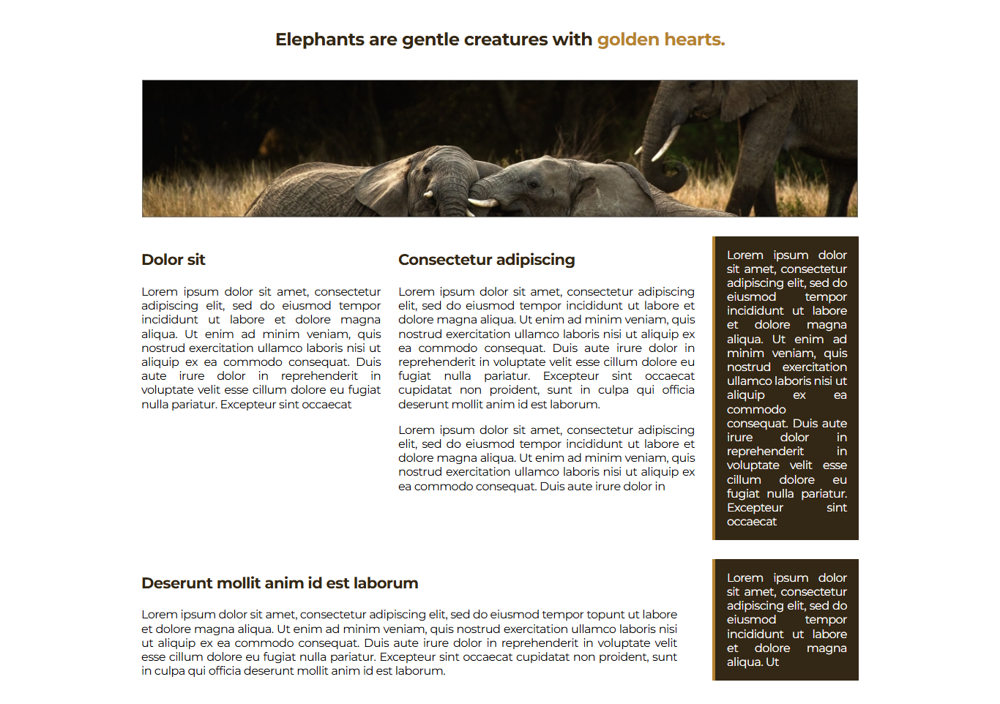
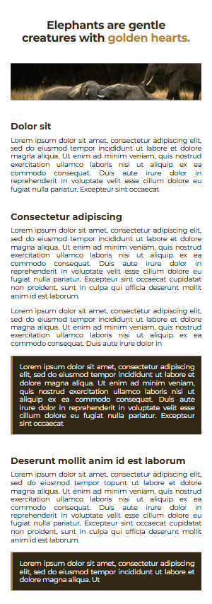

# Elephant Echo 🐘

A simple and responsive blog layout dedicated to the gentle giants of nature—elephants. 
This project serves as a minimalist blog template with a clean UI, mobile responsiveness, and structured content blocks.

## 🚀 Live Demo  
[View Elephant Echo](https://bhavikthakur.github.io/elephant-blog-practice/) 

## 📸 Preview  
  
   

## 🛠️ Tech Stack  
- **HTML5** - Semantic structure  
- **CSS3** - Modern styling with flexbox  
- **Normalize.css** - Consistent rendering across browsers  
- **Google Fonts (Montserrat)** - Clean and readable typography  

## 🎨 Features  
✅ Responsive design (desktop, tablet, mobile)  
✅ Elegant typography and color scheme  
✅ Highlighted text sections for emphasis  
✅ Optimized for smooth scrolling and readability  

## 📂 Folder Structure  
/project-folder <br>
│── /css <br>
│   ├── reset.css        # Resets default browser styles <br>
│   ├── styles.css       # Main styling file <br>
│   ├── media-queries.css # Responsive styles <br>
│── /images             # Contains all images & icons <br>
│── index.html          # Main HTML file <br>
│── README.md           # Documentation <br>

## 🔧 Setup & Usage  
1. Clone this repository:  
   ```bash
   git clone https://github.com/bhavikthakur/elephant-blog-practice.git 
2. Open index.html in your browser.

2. Open `index.html` in a browser.  
3. Customize styles in `css/styles.css` to personalize the blog.  

## 📢 Future Enhancements  
- Add real blog posts about elephants 🐘  
- Include a navigation bar for multi-page expansion  
- Improve accessibility features  

## 💡 Author  
Created by [Bhavik Thakur](https://github.com/bhavikthakur)  

## 🤝 Connect With Me  
💼 LinkedIn: [Bhavik Thakur](https://www.linkedin.com/in/bhavik-thakur/) <br>
🐦 Twitter: [Bhavik Thakur](https://x.com/BhavikkThakur) 


🌱 *"Elephants are gentle creatures with golden hearts."*  
